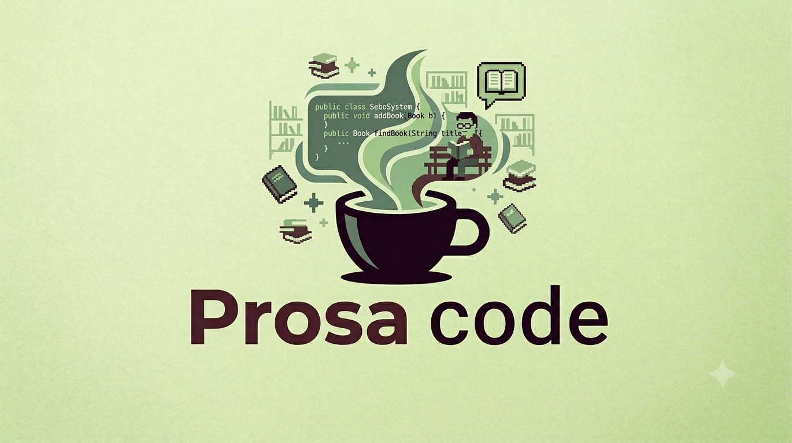
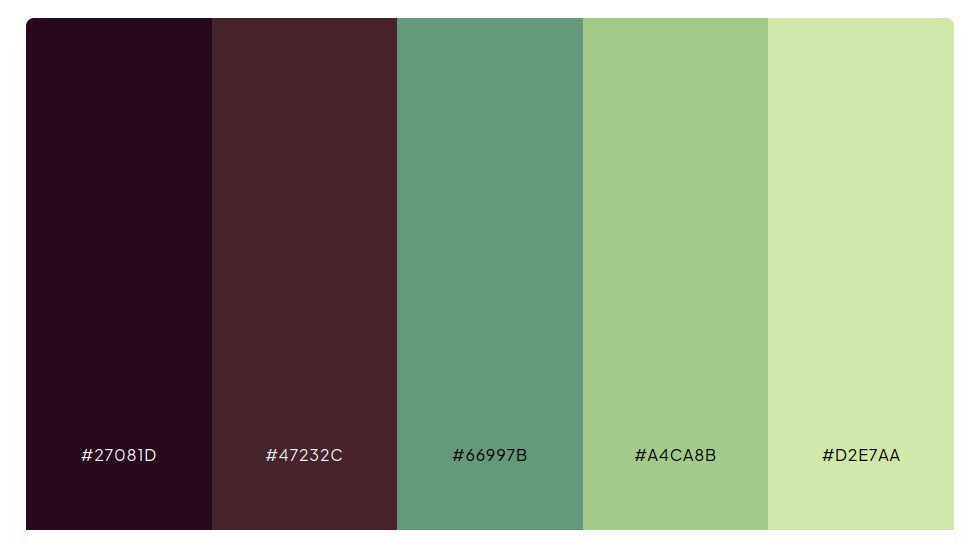
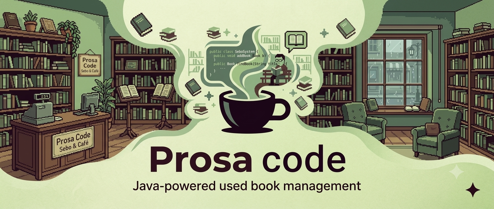

# 🎨 Mockups e Identidade Visual — Prosa Code

Esta pasta armazena as versões finais em alta fidelidade da identidade visual da **Prosa Code**, incluindo a logo oficial, a paleta de cores e o banner de apresentação.

---

## 🎨 1. Conceito e Criação da Logo

### 🎨 Autoria e Criação
- **Criação e Ideação:** Rayssa
- **Objetivo:** Criar uma marca visualmente forte que representasse o propósito da empresa e facilitasse a identificação da nossa solução de software para sebos e livrarias.

### 💡 Fundamentação
- **Remetendo ao Java:** A xícara de café foi escolhida por ser o símbolo universal da linguagem **Java**, utilizada no desenvolvimento do sistema.
- **Combinação Literária:** O café é um acompanhamento clássico do momento de leitura, conectando-se ao universo dos sebos e bibliotecas.
- **Elementos na Fumaça:** A fumaça subindo da xícara representa a criação: dentro do vapor surgem o código Java, os livros e a pessoa lendo.
- **Do Papel para o Digital:** A ideia nasceu de um protótipo desenhado à mão pela Rayssa e foi renderizada digitalmente via inteligência artificial (Gemini) utilizando a paleta de cores oficial da equipe.

### 🚀 Logo Digitalizada

---

## 🎨 2. Paleta de Cores Oficial

### 👥 Definição em Equipe
- **Decisão:** Escolhida colaborativamente por toda a equipe.
- **Conceito:** A escolha dos tons foi definida para transmitir **"uma vibe mais biblioteca"**, combinando a estética aconchegante dos sebos, páginas de livros e o clima de tomar um café durante a leitura.

### 🎨 Tabela de Cores (HEX)

| Cor | Código Hex | Descrição Visual / Aplicação |
| :---: | :---: | :--- |
| 🟣 | `#27081D` | Tom escuro profundo (base e contraste principal) |
| 🤎 | `#47232C` | Terroso / Vinho escuro (remete ao café e madeira) |
| 🌲 | `#66997B` | Verde médio atenuado |
| 🌿 | `#A4CA8B` | Verde suave (elementos secundários) |
| 🍃 | `#D2E7AA` | Verde claro pastel (fundos e suavização) |

---

## 🖼️ 3. Banner Oficial

### 🎨 Autoria e Conceito Original
- **Criação e Ideação:** Rayssa
- **Objetivo:** Ambientar o visitante do perfil da empresa no GitHub no universo que une café, leitura e tecnologia.

### 🚀 Versão Digitalizada (Pixel Art)

O esboço da Rayssa serviu de guia estrutural (*prompt visual*) para a renderização da imagem final em *pixel art*, combinando a composição planejada à paleta de cores definida pela equipe (`#27081D`, `#47232C`, `#66997B`, `#A4CA8B`, `#D2E7AA`).
