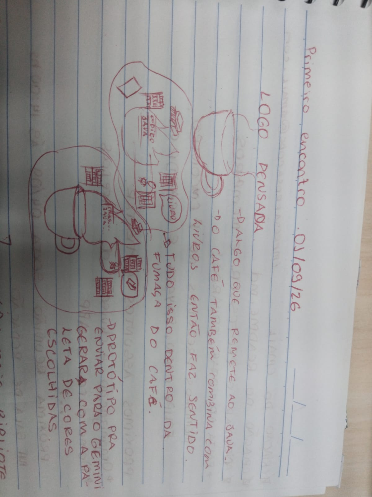
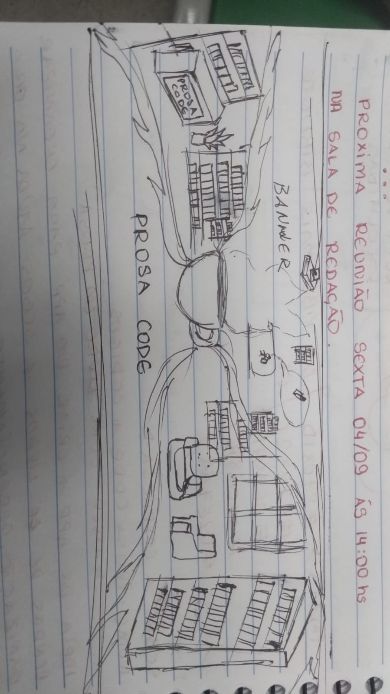

# ✏️ Wireframes e Esboços em Papel — Prosa Code

Esta pasta armazena os rascunhos de baixa fidelidade (*wireframes*), anotações de campo e esboços iniciais desenhados à mão durante a fase de ideação e planejamento da identidade visual da **Prosa Code**.

---

## ✏️ 1. Esboço da Logo

### 🎨 Autoria e Conceito
- **Ideação e Desenho:** Rayssa
- **Data do Primeiro Encontro:** 01/09/2026
- **Objetivo:** Definir a ideia inicial da marca unindo o símbolo do Java (café), a literatura (livros) e o ambiente de um sebo.

### 📐 Detalhes e Anotações do Rascunho
- **Símbolo Central:** A xícara de café remete diretamente ao Java (linguagem utilizada no desenvolvimento do projeto).
- **Elemento Criativo (Fumaça):** A fumaça do café se expande abrigando o código Java, os livros e a pessoa lendo.
- **Anotações:** Define a base para o envio ao modelo gerador (Gemini) junto com a paleta de cores escolhida pela equipe.

---

## ✏️ 2. Esboço do Banner

### 🎨 Autoria e Conceito
- **Ideação e Desenho:** Rayssa
- **Objetivo:** Estruturar visualmente o ambiente físico (café + sebo) que seria transformado no banner oficial do perfil da empresa.

### 📐 Composição Mapeada
- **Elemento Central (O Café):** A xícara posicionada ao centro soltando fumaça em ondas, que se expande e emoldura os cenários ao redor.
- **Espaço do Sebo (Lado Esquerdo):** Balcão de atendimento com a placa **Prosa Code**, estantes de livros e vasos de plantas.
- **Espaço de Leitura (Lado Direito):** Cantinho aconchegante com poltronas, janela para o exterior e estantes repletas de acervo.
- **Assinatura:** Nome **Prosa Code** destacado na área inferior do rascunho.
